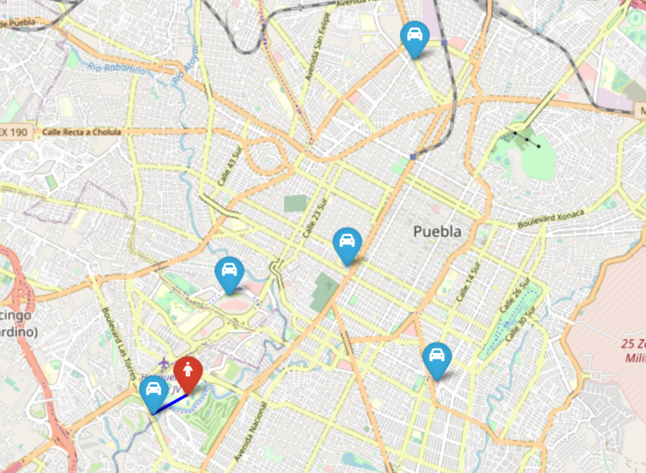

# Assimove
> HACK PUEBLA 2023

# Tabla de Contenidos

1. [¿Qué es AssiMove?](#¿qué-es-assimove)
2. [Arquitectura](#arquitectura)
3. [Componentes](#componentes)
    - [Backend](#backend)
    - [Frontend](#frontend)
    - [Base de datos](#base-de-datos)
    - [Networking](#networking)
4. [Contribuidores](#contribuidores)

# ¿Qué es AssiMove?

Una aplicación móvil que conecta personas con discapacidad con personas en busca de obtener ingresos económicos, al mismo tiempo que ayudando a las personas con discapacidad en movilidad esporádica, como para ir al banco, ir al supermercado, ir a una consulta médica, acompañado o acompañada a lo largo de dichas actividades.

# Arquitectura

Se diseñaron dos posibles arquitecturas para la aplicación.

## Arquitectura de desarrollo y producción con pocos usuarios

La primera arquitectura es una aproximación de monolito, que aprovecha las ventajas de AWS Amplify.

Entre las más importantes:

> Crear un back-end de AWS para su web, iOS o aplicación de Android con autenticación, datos, almacenamiento y más en cuestión de minutos.

> Crear de manera visual una IU de front-end con integración Figma de diseño a código y conecte la IU a un back-end con unos pocos clics.

Y aprovechando que todos los mocks de la aplicación se hicieron con Figma, la integración y desarrollo sería relativamente rápida cumpliendo de igual forma los requisitos de funcionalidad en tiempo real.

A continuación se ilustran los flujos a seguir para el backend y frontend respectivamente, así como la arquitectura propuesta:

## Arquitectura de producción altamente escalable

La segunda arquitectura es una aproximación de microservicios en la que se aprovecha la escabilidad y robustez que logramos a través de conexiones más complejas.

Entre las ventajas más importantes de esta aproximación:

> Se puede escalar por separado el frontend de los usuarios del frontend de los preestadores de servicio (**mooviers**), como si estas fueran aplicaciones distintas, logrando una mayor disponibilidad en la aplicación.

> Se pueden lograr costos menores debido al uso de servicios *serverless* como AWS Lambda para realizar y segmentar aún más las operaciones de la aplicación.

> La comunicación en tiempo real podría ser mucho más rápida a través de Amazon ElastiCache for Redis

A continuación se ilustra la arquitectura propuesta:

# Componentes

## Backend

Se encarga de guardar la información modificada del perfil, mooviers favoritos e historial de moves en la base de datos en [Amazon DynamoDB](#amazon-dynamodb).
Esta aplicación puede ser desarrollada en cualquier lenguaje de programación y también se encarga de lanzar la acción que desencadene el topic de [Amazon SNS](#amazon-sns).

### AWS Lambda (Python)

El componente primordial es una función de AWS Lambda que se encarga de ejecutar el algoritmos con las entradas de datos (las ubicaciones de los **mooviers** y del usuario).

Finalmente, este componente guarda un mapa en formato HTML que se almacena en Amazon S3 y que posteriormente es recuperado y mostrado en el frontend para que el usuario vea al **moovier** más cercano.

Un ejemplo del mapa mostrado después de ejecutar el algoritmo se ilustra a continuación:

### AWS Lambda (Creación de usuarios)

Esta función también puede ser programada con cualquier lenguaje compatible con AWS Lambda. Y ésta guarda la información en la base de datos de [Amazon DynamoDB](#amazon-dynamodb).

### AWS Lambda (Guardar ubicación de Mooviers)

Esta función es el intermediario entre [AWS AppSync](#aws-appsync) y [Amazon ElastiCache for Redis](#amazon-elasticache-for-redis)

### Amazon SNS

Se encarga de notificar mediante correo y notificación de teléfono al **moovier** que un usuario desea solicitar un **move**. De forma que él a través de la misma app, pueda aceptar o rechazar ese **move**.

### AWS AppSync

Se encarga de crear una conexión mediante WebSockets que permite una comunicación en tiempo real.

### Amazon Cognito

Permite utilizar cuentas existentes para autenticarse como Google, Facebook, etc.

## Frontend

Se encarga de la interfaz de usuario para el usuario y para el **moovier** que utiliza la aplicación para prestar sus servicios.

### Elastic Load Balancer

Se encarga de distribuir el tráfico entre las instancias de EC2 que suministren el frontend acorde el tipo de usuario que lo utiliza (usuario/cliente o **moovier**).

### EC2 Auto Scaling

Se encarga de escalar e incrementar las instancias de EC2 para un frontend específico de *React*. Y es por esa razón que se han colocado 2 componentes de este tipo. De forma que auto escalen de forma independiente.

## Base de datos

### Amazon DynamoDB

Base de Datos NoSQL para la administración de usuarios. Precisamente como los usuarios distintos el hecho de usar una base no relacional hace más sentido.

### Amazon ElastiCache for Redis

Base de datos que ofrece una latencia inferior al milisegundo para operaciones de lectura y escritura y admite múltiples casos de uso como operaciones en tiempo real, utilizada para la gestión de ubicaciones de los **mooviers**.

## Networking

### Amazon Route 53

Resolución DNS.

### AWS WAF

Capa de seguridad después de autenticación.

### Amazon CloudFront

Content Delivery Network (CDN) para ubicar copias del frontend en Points of Presence o Edge Locations más cercanos a los usuarios.

### Internet Gateway

Permite el ingreso de datos a través de internet.

### Amazon API Gateway

Permite administrar quien realiza las llamadas a las API, mediante claves de API, mediante métodos más avanzados y también poner una capa de rate limiting para uso excesivo de la API.

# Contribuidores

- [David Lázaro](https://github.com/David-Lazaro-Fernandez)
- [Oscar Santos](https://github.com/OscarSantosMu)
- Héctor Pineda